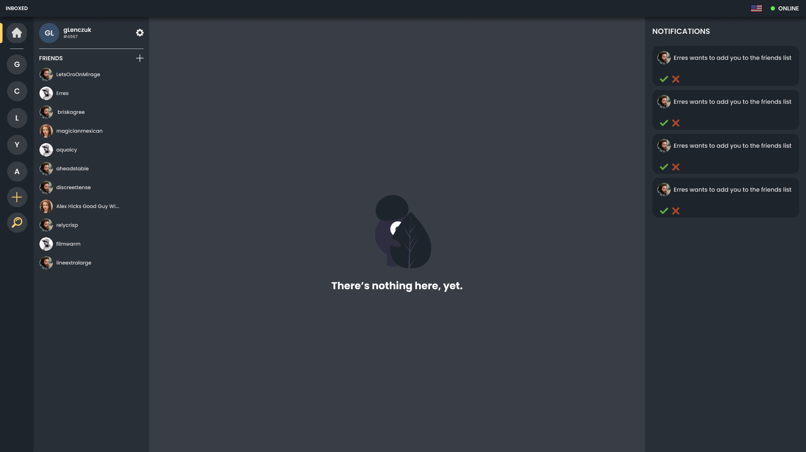

# Inboxed

Inboxed is an educational project of a network communicator, inspired by applications such as Discord, Slack and others. Our goal is to create web, desktop and mobile applications concetrated around backend based on web sockets.

# Table of Content

[Technologies](#technologies) 
[Project Setup Instructions](#project-setup-instructions) 
[Useful Resources](#useful-resources)

# Technologies

- Monorepo with Lerna
- Typescript
- Docker
- Express
- TypeORM
- PostgreSQL
- Vue 3
- SocketIO
- Flutter and Dart
- Electron
- Sentry (error monitoring)
- CI/CD with Github Actions

# Project Setup Instructions

## Web Setup

In order to run our web project, you will need Node.js and Docker on your PC. Monorepo is managed by Lerna, so all commands should be run in root directory.

1. First of all, you should install dependencies in root directory by: `npm install`. That command will install Lerna in project, which helps you further.
2. To install dependencies in all apps, run: `npm run bootstrap`.
3. In **apps/api** folder, copy `.env.example` file and change its name to `.env`.
4. Now you can run web application, but you will need a database to work that properly. You can run database in docker by: `docker-compose up`.
5. When database is running, you can run web app by that command: `npm run dev:web`.

## Mobile Setup

In progress.

## Desktop Setup

In progress.

# Useful Resources

[Designs in Figma](https://www.figma.com/file/T9l3qS4m43YFZwwKQUQtbb/Inboxed?node-id=0%3A1) 
[Project Wiki](https://github.com/gLenczuk/inboxed/wiki)
